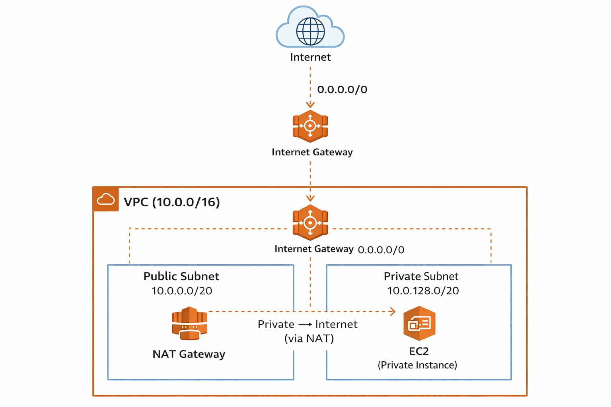
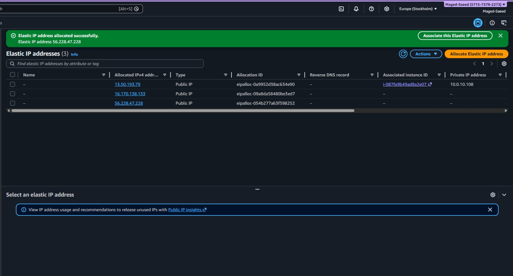
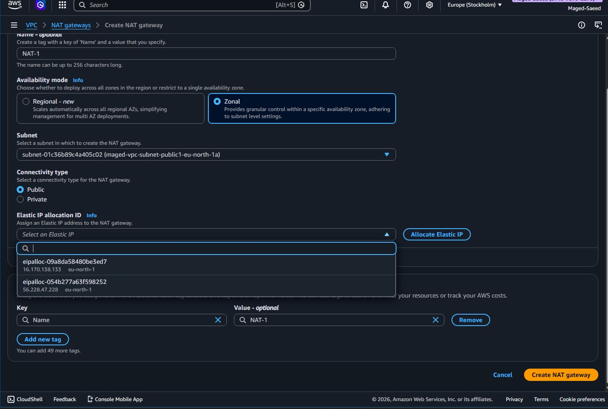
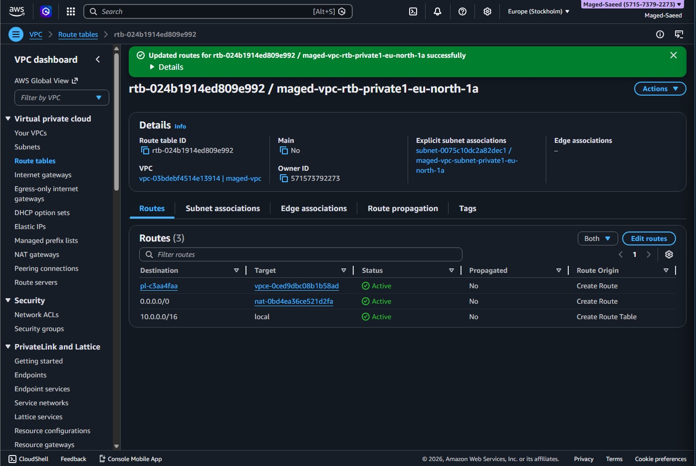
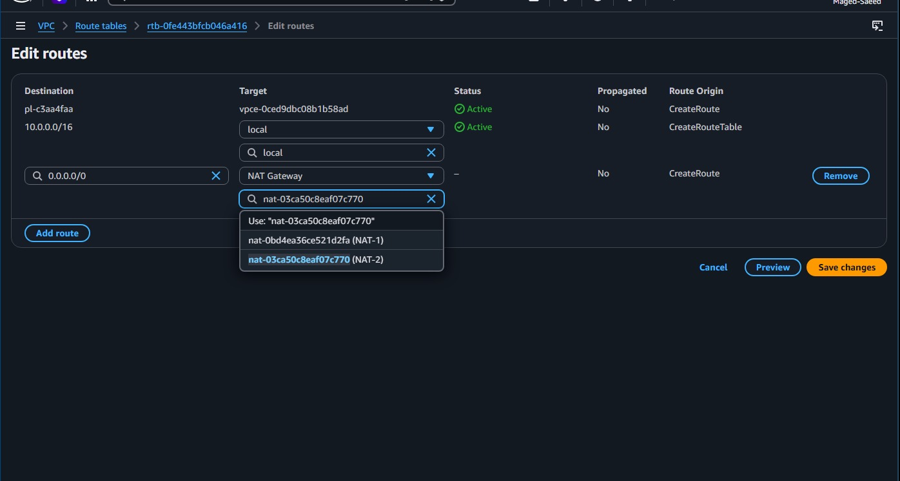
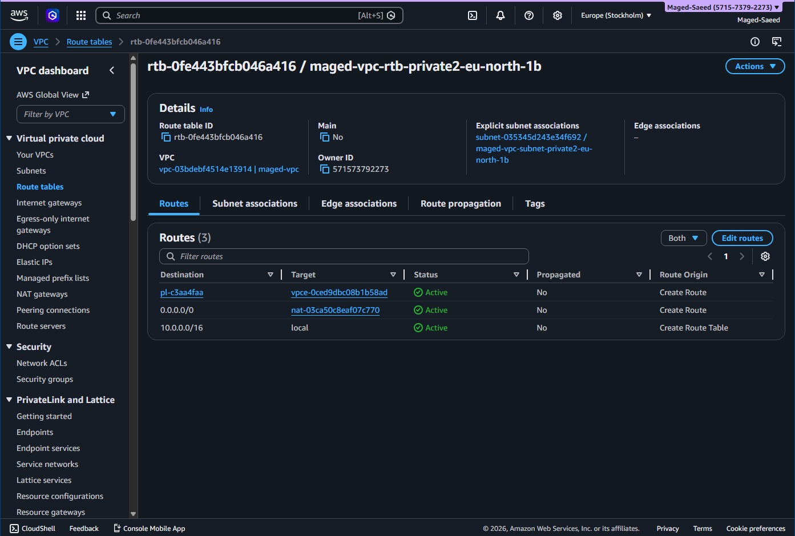
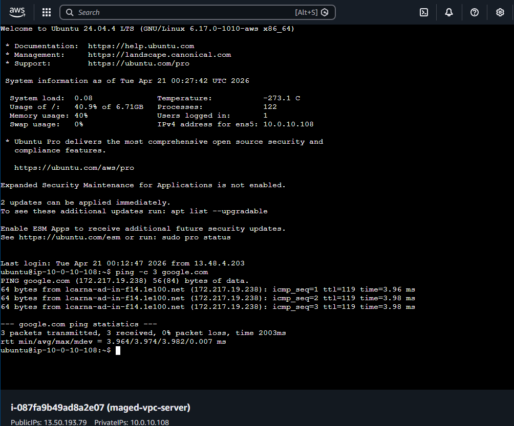

# AWS Secure VPC with NAT Gateway

## Overview
This project demonstrates building a secure AWS VPC architecture with public and private subnets.  
Private instances do not have public IPs and access the internet securely through a NAT Gateway.

---

## Architecture

- **VPC CIDR:** 10.0.0.0/16

- **Public Subnet (eu-north-1a)**
  - Hosts NAT Gateway
  - Connected to Internet Gateway

- **Private Subnet 1 (eu-north-1a)**
- **Private Subnet 2 (eu-north-1b)**
  - Used for internal resources (EC2)

- **Internet Gateway (IGW)**
  - Attached to VPC

- **NAT Gateway**
  - Located in public subnet
  - Attached to Elastic IP
  - Provides outbound internet to private subnets

---

## Networking Flow

- Public subnet → Internet via **Internet Gateway**
- Private subnets → Internet via **NAT Gateway**
- Private instances are **not publicly accessible**

---

## Route Tables

### Public Route Table
| Destination | Target |
|------------|--------|
| 0.0.0.0/0  | Internet Gateway |
| 10.0.0.0/16 | local |

---

### Private Route Tables
| Destination | Target |
|------------|--------|
| 0.0.0.0/0  | NAT Gateway |
| 10.0.0.0/16 | local |

---

## Key Features

- Private EC2 instances have **no public IP**
- Secure outbound internet via NAT Gateway
- Network isolation (public vs private)
- Multi-AZ setup
- Real-world AWS architecture

---

## Implementation Steps

1. Created VPC (10.0.0.0/16)
2. Created subnets:
   - 1 Public Subnet
   - 2 Private Subnets
3. Attached Internet Gateway
4. Allocated Elastic IP
5. Created NAT Gateway in public subnet
6. Configured route tables:
   - Public → IGW
   - Private → NAT
7. Associated subnets with route tables
8. Launched EC2 in private subnet (no public IP)

---

## Testing

### Private Instance Internet Test

```bash
ping -c 3 google.com
```

Result:
- Replies received successfully  
- 0% packet loss  

This confirms:
- NAT Gateway is working  
- Private instance has internet access  

---

## Architecture Diagram



---

## Screenshots

### 1. Elastic IP Allocation


### 2. NAT Gateway Creation


### 3. Private Route Table (Initial)


### 4. NAT Route Configuration


### 5. Private Route Table (Final)


### 6. Private Instance Ping Test


---

## Conclusion

This project demonstrates a production-style AWS network:

- Private resources are not exposed to the internet  
- Internet access is controlled via NAT Gateway  
- Proper subnet and routing design  
- Secure and scalable architecture  
